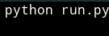
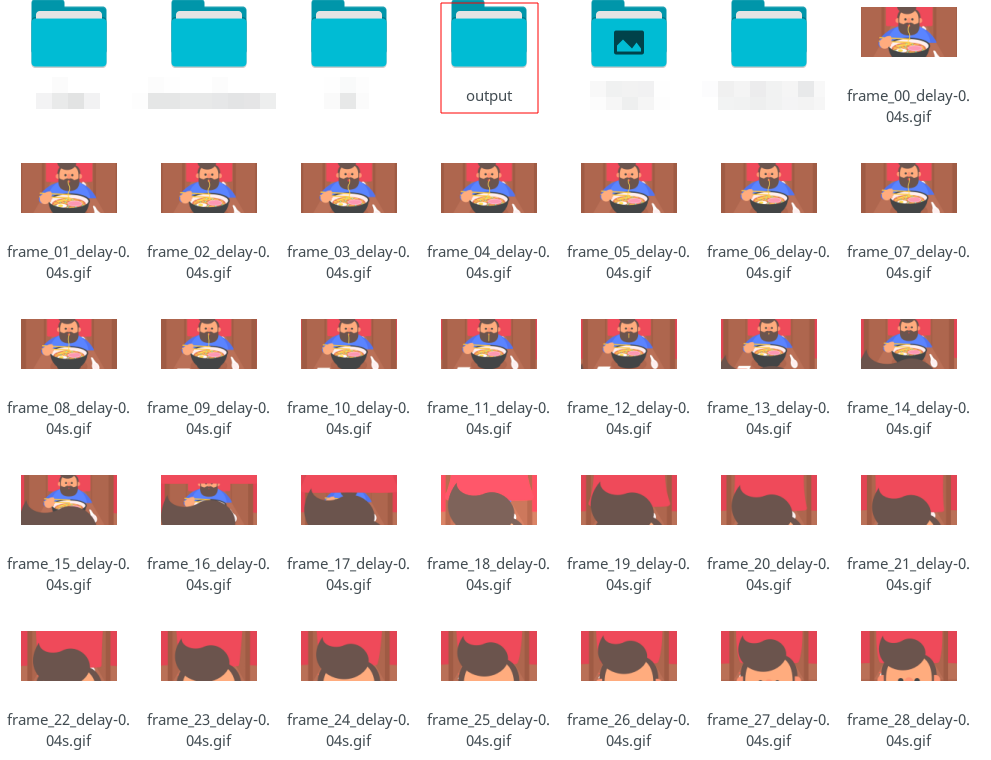

# Simple-Frames-To-GIF

## Install imageio

- Linux

~~~bash
sudo apt install python-imageio
~~~

-Windows

~~~python
	python get-pip.py install
	pip install imageio
~~~

## Use

## Run program

# Folder called output created

# Enjoy!

